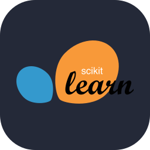
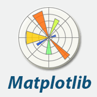
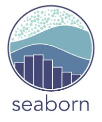

# 📚 SeSAC_Crawling_Study

## 📖 소개

SeSAC Crawling Study 레포지토리는 웹 크롤링에 대한 다양한 기법과 개념을 다루고, 학습 과정에서 실습한 코드와 예제를 기록한 공간입니다. 웹에서 데이터를 자동으로 수집하고 처리하는 방법을 배우며, BeautifulSoup, async, Playwright 등 여러 도구를 활용한 실습을 진행했습니다.

### 학습 내용

| 구분 | 학습 내용 |
|--|--|
| **기본 크롤링** | BeautifulSoup을 이용한 웹 데이터 크롤링 기초 학습 |
| **복잡한 크롤링** | 네이버 뉴스 기자 리스트를 대상으로 한 복잡한 크롤링 실습 |
| **비동기 처리** | Async를 활용해 크롤링 성능을 향상시키는 방법 실습 |
| **파일 캐싱** | Pickle을 사용한 데이터 저장 및 캐싱 처리 |
| **Playwright** | Playwright를 이용한 웹 자동화 및 스크래핑 방법 |

## 🛠️ 기술 스택

|<center>VScode</center>|<center>Python</center>|<center>BeautifulSoup4</center>|<center></center>|<center></center>|<center></center>|
|--|--|--|--|--|--|
|<p align="center"></p>|<p align="center"></p>|<p align="center"></p>|<p align="center"></p>|<p align="center"></p>|<p align="center"></p>|
|||||||


## 📂 Directory Structure

```plaintext
SeSAC_Crawling_Study/
├── README.md 
├── icons/
├── skeleton/
│   ├── basic_crawling.py
│   ├── bit_complex_crawling.py
│   ├── async_crawling.py
│   ├── code2info.pickle
│   ├── web_control.js
│   ├── async_transfer/
│   │        ├──bit_complex_crawling.py
│   │        └──abit_complex_crawling.py
│   ├── playwright/
│   │        └── playwright_tutorial.py
│   └── korail_quest/
│            └── korail_reservation.py
└── async/
    ├── async_before.py  
    └── async_after.py
```

## 💻 skeleton
|번호|구분|파일|설명|비고|
|--|--|--|--|--|
|01|crawling|[basic_crawling.py](./skeleton/basic_crawling.py)|BeautifulSoup을 활용한 웹크롤링 실습||
|02|crawling|[bit_complex_crawling.py](./skeleton/bit_complex_crawling.py)|네이버 뉴스 기자 리스트 웹크롤링 실습||
|03|async|[bit_complex_crawling.py](./skeleton/bit_complex_crawling.py)|async을 활용한 네이버 뷰스 기자 리스트 웹크롤링 실습||
|04|pickle file|[code2info.pickle](./skeleton/code2info.pickle)|pickle을 통한 file caching||
|05|js file|[web_control.js](./skeleton/web_control.js)|js 기본 문법 정리||

<details open>
<summary> async_transfer </summary>

|번호|구분|파일|설명|비고|
|--|--|--|--|--|
|01|async|[bit_complex_crawling.py](./skeleton/async_transfer/bit_complex_crawling.py)|네이버 뉴스 기자 리스트 웹크롤링 실습 비동기 전||
|02|async|[abit_complex_crawling.py](./skeleton/async_transfer/abit_complex_crawling.py)|네이버 뉴스 기자 리스트 웹크롤링 실습 비동기 후||

</details>

<details open>
<summary> playwright </summary>

|번호|구분|파일|설명|비고|
|--|--|--|--|--|
|01|playwright|[playwright_tutorial.py](./skeleton/playwright/playwright_tutorial.py)|playwright 학습||

</details>

<details open>
<summary> korail_quest </summary>

|번호|구분|파일|설명|비고|
|--|--|--|--|--|
|01|실습|[korail_reservation.py](./skeleton/korail_quest/korail_reservation.py)|korail 기차표 예매 실습||

</details>

## 📝 async

|번호|구분|파일|설명|비고|
|--|--|--|--|--|
|01|async|[async_before.py](./async/async_before.py)|async 전 실행시간 실습||
|02|async|[async_after.py](./async/async_after.py)|async 후 실행시간 실습||
